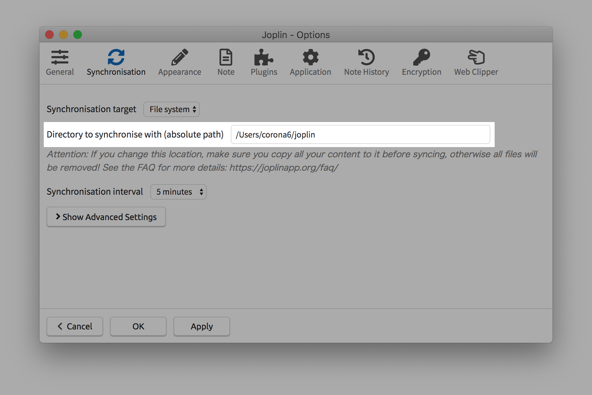

# joplinclean
delete unused resources/revisions/tags for [Joplin](https://joplinapp.org/)

## Warning

- This is does not support for encryption.
- Only can use for file system synchronise.

## Install

```
$ curl --create-dirs -o ~/.joplinclean-bin/joplinclean https://raw.githubusercontent.com/corona6/joplinclean/master/joplinclean
$ chmod +x ~/.joplinclean-bin/joplinclean
$ sudo ln -s ~/.joplinclean-bin/joplinclean /usr/local/bin/joplinclean
```

## Usage

```
Usage:
  joplinclean [-frtyh] absolute-path

Examples:
  # delete image or file that not used in the note
  joplinclean /path/to/synchronise/directory

  # delete the history (revisions) of the note which are already deleted
  joplinclean -r /path/to/synchronise/directory

  # delete the tags that not link to any notes
  joplinclean -t /path/to/synchronise/directory

Options:
  -f, --force         Delete unused resources even if it's in the revision
  -r, --revision      Delete unused revisions
  -t, --tag           Delete unused tags
  -y, --yes           Automatic yes to all prompts
  -h, --help          Print this help
```

## Example

```
joplinclean /Users/corona6/joplin
```

